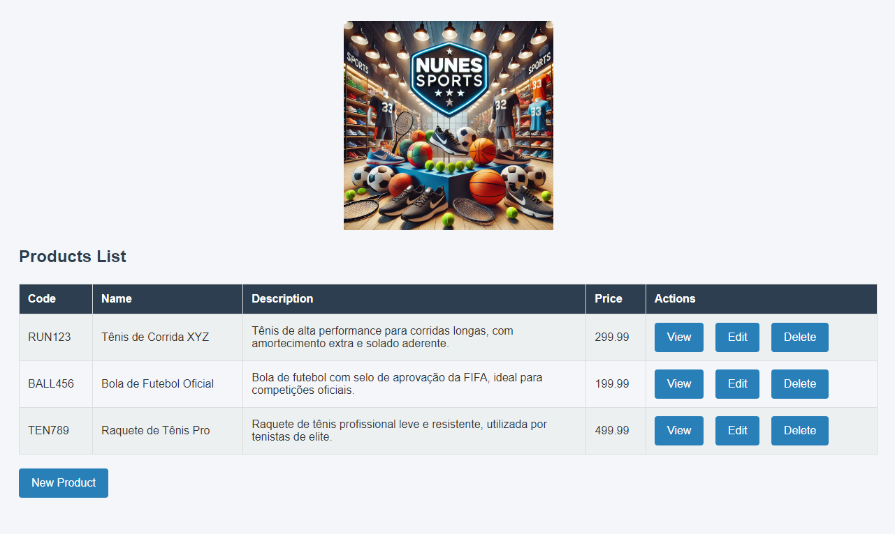
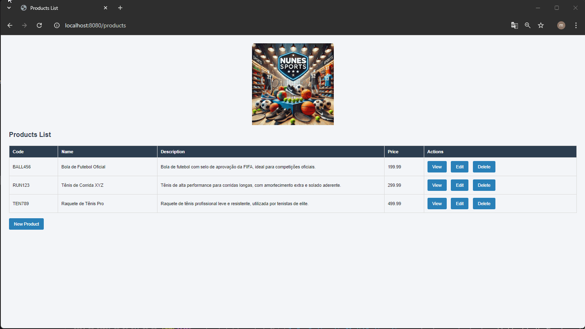

# Projeto Nunes Sports 🏀👟🥅

  

## Introdução

O **Projeto Nunes Sports** é uma aplicação web desenvolvida para gerenciar produtos esportivos. A aplicação oferece operações CRUD (Create, Read, Update, Delete) para manter um catálogo de produtos atualizado, utilizando o banco de dados PostgreSQL e tecnologias modernas como Spring Boot e Thymeleaf.

## Projeto em Utilização

## Funcionalidades

- **Cadastro de Produtos:** Adicione novos produtos informando código, nome, descrição e preço.
- **Edição de Produtos:** Atualize as informações de um produto existente.
- **Exclusão de Produtos:** Remova produtos do catálogo.
- **Visualização de Produtos:** Consulte a lista completa de produtos.

## Tecnologias Utilizadas

- **Java 21**
- **Spring Boot**
- **Thymeleaf**
- **PostgreSQL**
- **Hibernate Validator**
- **Maven**
- **Docker**

## Validação de Dados

- O código do produto é único, garantindo que não haja duplicação.
- O preço do produto deve ser um número positivo e maior que zero.

## Como Usar

### Usando Docker

1. Clone este repositório.
2. Navegue até o diretório do projeto.
3. Execute `docker-compose build` para construir a imagem do container.
4. Execute `docker-compose up` para iniciar a aplicação junto com o banco de dados PostgreSQL em containers Docker.
5. Acesse a aplicação no navegador: [http://localhost:8080/products](http://localhost:8080/products).

### Configuração Manual

1. Clone este repositório.
2. **Instale e configure:**
   - JDK 21
   - Maven
   - PostgreSQL
3. Navegue até o diretório do projeto e execute `mvn clean install` para instalar as dependências e compilar o projeto.
4. Configure o PostgreSQL de acordo com as instruções no `application.properties`.
5. Inicie a aplicação com `mvn spring-boot:run`.
6. Acesse a aplicação no navegador: [http://localhost:8080/products](http://localhost:8080/products).

## Desenvolvedor

- Matheus Zancanella - [LinkedIn](https://www.linkedin.com/in/matheuszancanella) - [Trailhead](https://www.salesforce.com/trailblazer/matheuszancanella)